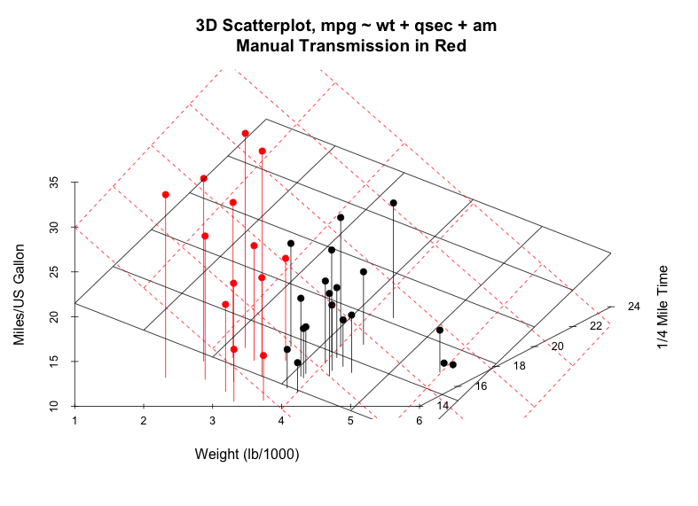

```{r global_options, echo=FALSE, warning=FALSE, message=FALSE, error=FALSE, fig.path="/Figures"}
library(knitr)
#library(kfigr)
knitr::opts_chunk$set(echo=FALSE, warning=FALSE, message=FALSE, error=FALSE, highlight=TRUE)
library(datasets)
data("mtcars")
library(car)
library(ggplot2)
library(gplots)
library(scatterplot3d)
mtcars$am <- as.factor(Recode(mtcars$am, "0='Automatic';1='Manual'"))
```

# EXECUTIVE STATEMENT

This report looks for the impact of transmission type (automatic or manual) on vehicle Miles Per Gallon (MPG). The dataset used is _Motor Trend_ magazine's _mtcars_ dataset of 1973-74 models. Multivariate regression analysis is the strategy used to build competing models in an attempt to incorporate any predictors that confound transmission's relationship with MPG.

The report concludes, _with 95% confidence_, that vehicles with manual transmissions have a statistically significant advantage of **between 0.05 to 5.83 MPG** (holding all other predictors constant) over vehicles that have an automatic transmission. The mean advantage for manuals observed in this dataset is **2.94 MPG**. Note: The code and complete analysis may be found at my [github repo](https://github.com/ashirwad08/RegressionModels/blob/master/mtcars_analysis.Rmd).

# EXPLORATORY ANALYSIS

The _mtcars_ dataset contains 32 observations across 11 variables. We take an initial look at the relationship between our focus of inquiry: MPG and Transmission Type. See the _violin plot_ in *Figure 1.1* (appendix). We immediately note that there is non-constant variance between the two groups.  

# COMPETING MODELS

## Model 0: Base Model

From the Exploratory Analysis above, we have our base model: 

```{r}
model0 <- lm(mpg~am, data=mtcars)
#knitr::kable(summary(model0)$coef)
```  

MODEL 0, **mpg = `r signif(summary(model0)$coef[1,1], 3)` + `r signif(summary(model0)$coef[2,1], 3)` * amManual**  

Although this model suggests a significant difference of `r signif(summary(model0)$coef[2,1], 3)` in MPG for manual transmissions over automatics, the poor _adjusted R^2^_ value of *0.33* is cause for concern. Moreover, the non-constant variance shown in *Figure 1.1* pretty much renders this model as unsuitable. _We keep it around for baseline comparisons only._

## Model 1: Step-wise Addition/Elimination

In order to consider the entire spectrum of possible predictors in the dataset (all are potentials), we perform a step-wise regression on all potential predictors (_mpg ~ ._):  
```{r echo=T}
model1 <- step(lm(mpg~., data=mtcars), direction="both", trace=FALSE)
```   

MODEL 1: **mpg = `r signif(summary(model1)$coef[1,1], 3)` `r signif(summary(model1)$coef[2,1], 3)` * wt + `r signif(summary(model1)$coef[3,1], 3)` * qsec + `r signif(summary(model1)$coef[4,1], 3)` * amManual** ; _adjusted R^2^_ is *0.83*.  

_Note:_ There's a concern here that the mean MPG for automatic transmissions (the intercept), holding other predictors constant, is _not_ significant.  

## Model 2: Linear Correlation + Step + VIF

We turn to linear relationship with the response to help us pick likely predictors (*Figure 1.2*, as shown by _adjusted R^2^_, and a significant coefficient). The following candidates emerge (in decreasing strength of R^2^): **wt, cyl, disp, hp, and drat**. We then use the _step-wise_ addition/elimination process on these candidates, combined with a *VIF* analysis to eliminate _multicollinearity_; we get the equation: $mpg ~ am + wt + hp$.

```{r}
model2.step <- step(lm(mpg~am+wt+cyl+disp+hp+drat, data=mtcars), direction="both", trace=FALSE)
#knitr::kable(coef(model2.step), col.names = 'estimate', caption='Coefficients for Model 2')
```  
```{r eval=F}
knitr::kable(sqrt(vif(lm(mpg~am+wt+cyl+hp, data=mtcars))), col.names='SD Inflation', caption = 'SD Inflation for Model 2')
```  
```{r}
model2 <- lm(mpg~wt+hp+am, data=mtcars)
```  
MODEL 2, **mpg = `r signif(summary(model2)$coef[1,1], 3)` `r signif(summary(model1)$coef[2,1], 3)` * wt - `r signif(summary(model1)$coef[3,1], 3)` * hp + `r signif(summary(model1)$coef[4,1], 3)` * amManual** ; _adjusted R^2^_ is *0.82*.

_Note:_ There's a concern here that the mean MPG difference for manual transmissions, holding other predictors constant, is _not_ significant.

# VERIFYING REGRESSION ASSUMPTIONS

## Variance of Means Test

We want to be certain that the predictors added to each model cause a significant difference in the sum of squares and overall variation. We verify this with an ANOVA test for Models 1 and 2 (**ONLY 1 is SHOWN**):

```{r}
temp <- lm(mpg~am, data=mtcars)
temp1 <- update(temp, mpg~am+wt)
temp2 <- update(temp, mpg~am+wt+qsec)
temp3 <- update(temp, mpg~am+wt+hp)

knitr::kable(anova(temp, temp1, temp2), caption='Model 1 ANOVA Test')

#knitr::kable(anova(temp, temp1, temp3), caption='Model 2 ANOVA Test')

rm(list=c('temp','temp1','temp2','temp3'))
```  

We see that in each model (entire code available at my [github repo](https://github.com/ashirwad08/RegressionModels/blob/master/mtcars_analysis.Rmd)), adding the predictors causes significant change in group variance.

## Residual Diagnostics

Finally, we take a loot at some Residual plots (*Figure 2.1*). The residual analysis shows us that Models 1 and 2 are roughly homoskedastic, while their residuals approximate a normal distribution. Model 2, however, does have some outliers far away from the quantile line. These need to be investigated. Model 1 also has some outliers that need a closer look. _Can we eliminate these?_

## Evaluating Influence  

*Figure 2.1* also shows us some leverage points for Models 1 and 2. We're concerned about leverage points that _also_ exert more influence on the model; this might cause the regression line to bend unfairly towards such values. In order to quantify this combination of influence and leverage, we see the major _Cook's Distance_ measures for each such leverage point (**ONLY model 2 is SHOWN**):  

```{r}
#knitr::kable(which(cooks.distance(model0) > (4/(nrow(mtcars)-3-1)) ), col.names = "Model 0: Cook's Dist.")

#knitr::kable(which(cooks.distance(model1) > (4/(nrow(mtcars)-3-1)) ), #col.names = "Model 1: Cook's Distances of Concern" )

knitr::kable(which(cooks.distance(model2) > (4/(nrow(mtcars)-3-1)) ), col.names = "Model 2: Cook's Distances of Concern" )

# look at each corresponding observation and make a manual determination on whether or not to remove the outliers.
```    

In reviewing these outlier records, however, there is *no* indication of erroneous data points. These are merely extreme specimens of a combination of predictor values. We therefore err on the side of caution with our regression assumptions by choosing *not* to remove these data points from our models.  

# BEST FIT MODEL and CONCLUSIONS

We see that Model 1 has a slight advantage over Model 2 in terms of the _adjusted R^2^_. Moreover, the overall outlier exertion on the model (judged in terms of their mean Cook's Distance) seems to be slightly better for Model 1. We therefore choose model 1 to represent our best fit model:  

BEST FIT MODEL: **mpg = `r signif(summary(model1)$coef[1,1], 3)` `r signif(summary(model1)$coef[2,1], 3)` * wt + `r signif(summary(model1)$coef[3,1], 3)` * qsec + `r signif(summary(model1)$coef[4,1], 3)` * amManual**   

The average MPG for vehicles with manual transmissions - while holding weight, quarter mile time, and the automatic transmission coefficients constant - sees an advantage of **2.94 Miles Per Gallon** over the automatics in this dataset. Furthermore, we state with *95% confidence*, that manual transmissions enjoy a positive advantage in the range of **0.05 to 5.83 MPG** over their automatic counterparts, while holding weight and qsec values constant at the coefficients shown by the equation above.  

```{r eval=F}
knitr::kable(confint(model1), caption = 'Confidence Intervals for Coefficients of Model 1')
```
Finally, *Figure 3* summarizes the relationship between the automatic and manual transmission groups in the 3d scatter. We see that the best fit plane of both groups have different slopes, as suggested by our model. It's interesting to note that heavier cars seem to have automatic transmissions.


***  

# APPENDIX  

Entire markdown, including my code is available at my [github repo](https://github.com/ashirwad08/RegressionModels/blob/master/mtcars_analysis.Rmd).

## Figure 1.1: Violin Plot Exploring MPG Vs. Transmission

This scatter superimposed on a violin plot shows us that there is non-constant variance between two transmission types. This pretty much _eliminates_ the viability of Base Model 0 (mpg ~ am) as a suitable candidate for our analysis.

```{r plot1_1, anchor='plot1_1', fig.height=3}
g1 <- ggplot(data=mtcars, aes(x=am, y=mpg)) + geom_violin(trim = T, aes(fill=am), alpha=.4) + 
        geom_jitter(position = position_jitter(width=.05), size=5, aes(col=am)) +
        labs(title='Variance Exploration (Violin + Scatter) \n of MPG Vs. Auto/Manual Transmissions', 
             x='Transmission Type', y='Miles Per Gallon (MPG)')  + theme_bw()
g1
```  

## Figure 1.2: Linear Correlations (Response-Predictor Pairs)

This scatterplot produces a pairs plot with the lower panel showing the _adjusted R^2^_ value between response and predictor, as well as the coefficient's p-value. The font size increases by strength of the correlation. 

```{r fig.width=8, fig.height=6}
# First, I write a function (edited from ?pairs) to display the correlation between response-predictor pairs and it's significance. This function adjusts the font size of the text with the strength of correlation:
panel.cor <- function(x, y, digits = 2, prefix = "", cex.cor, ...)
{
    usr <- par("usr"); on.exit(par(usr))
    par(usr = c(0, 1, 0, 1))
    #r <- abs(cor(y, x))
    r <- signif(summary(lm(y~x))$adj.r.squared, 3)
    r.p <- signif(summary(lm(y~x))$coef[2,4], 4)
    #r.p <- signif(cor.test(y, x, alternative="two.sided", method="pearson")$p.value, 4)
    #p <- round(summary(lm(y~x), data=data.frame(x=x,y=y))$coef[2,4], 4)
    txt <- format(c(r, 0.123456789), digits = digits)[1]
    txt <- paste0(prefix, 'A.r2 = ', txt, '\n p-val = ', r.p)
    if(missing(cex.cor)) cex.cor <- 0.8/strwidth(txt)
    text(0.5, 0.5, txt, cex = cex.cor * r)
}

# function to plot an abline in the pairs plot instead of smoother
panel.line <- function(x, y, digits = 2, prefix = "", cex.cor, ...)
{
        temp.fit <- lm(y~x, data=data.frame(x=x, y=y))
        
        points(x=x, y=y, pch=21, col='black', bg='yellow')
        abline(a=temp.fit$coef[1], b=temp.fit$coef[2], lwd=1, col='blue')
        
}

#all predictors
pairs(mpg~., data=mtcars, upper.panel=panel.line, cex=1,cex.labels=2,font.labels=2, lower.panel=panel.cor)
```   

## Figure 2.1: Residual Diagnostic Plots

We plot 3 Residual diagnostics for each model in each column of the grid below:  

```{r fig.height=6}
#library(gplots)
par(mfcol=c(5,3), mar=(c(3, 0, 0, 1)))
textplot("Model 0 (Base)", cex=1)
palette(c('cyan','green', 'black'))
plot(model0, pch=21, col='black', bg=mtcars$am)

textplot("Model 1 (All Predictors, Step)", cex=1)
palette(c('cyan','green', 'black'))
plot(model1, pch=21, col='black', bg=mtcars$am)

textplot("Model 2 (Corr, Step, VIF)", cex=1)
palette(c('cyan','green', 'black'))
plot(model2, pch=21, col='black', bg=mtcars$am)
```

*Influence Plots* (not shown) may be [seen here](https://github.com/ashirwad08/RegressionModels/blob/master/Model%201%20and%202%20Influence%20Plots.png).  

```{r eval=F, fig.height=4}
par(mfrow=c(2,1), mar=c(5, 5, 2, 3))
#influencePlot(model0, id.col='blue')
influencePlot(model1, id.col='darkgreen')
influencePlot(model2, id.col='brown')
```  

## Figure 3: Best Fit Model (Scatter)

Finally, we visualize a 3D scatter of our best fit model. The red plane shows the best fit plane for manual transmissions. As expected, it highlights a difference in slope from the best fit automatic plane in black:

**mpg = `r signif(summary(model1)$coef[1,1], 3)` `r signif(summary(model1)$coef[2,1], 3)` * wt + `r signif(summary(model1)$coef[3,1], 3)` * qsec + `r signif(summary(model1)$coef[4,1], 3)` * amManual**   



```{r eval=F}
# g2 <- ggplot(data=mtcars, aes(x=qsec, y=mpg, size=wt, col=am))
# g2 + geom_point() +
#         geom_abline(intercept = coef(model1)[1], slope=coef(model1)[2]+coef(model1)[3]) +
#         geom_abline(intercept = coef(model1)[1]+coef(model1)[4], slope=coef(model1)[2]+coef(model1)[5]+coef(model1)[3]+coef(model1)[6])

plot3d <- scatterplot3d(z=mtcars$mpg, x=mtcars$wt, y=mtcars$qsec, pch=19, type='h', 
                        grid=F, box=F,
                        color=as.numeric(mtcars$am), angle=40,
                        main="3D Scatterplot, mpg ~ wt + qsec + am \n Manual Transmission in Red", xlab='Weight (lb/1000)', 
                        ylab='1/4 Mile Time', zlab='Miles/US Gallon')

# plane.auto <- plane3d(coef(model1)[1], x.coef=coef(model1)[2], y.coef=coef(model1)[3], lty='dashed')
plot3d$plane3d(coef(model1)[1]+coef(model1)[4], x.coef=coef(model1)[2]+coef(model1)[5], y.coef=coef(model1)[3]+coef(model1)[6], lty='solid', col='blue')
plot3d$plane3d(coef(model1)[1], x.coef=coef(model1)[2], y.coef=coef(model1)[3], lty = 'solid', col='green')
```   

Note: _Knitr_ has a bug rendering my second regression plane on the 3d plot, so I inserted an image instead. The code for the plot may be seen at my [github repo](https://github.com/ashirwad08/RegressionModels/blob/master/mtcars_analysis.Rmd).

